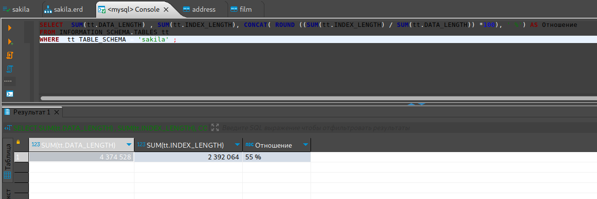

# Домашнее задание к занятию "`12.5. «Индексы»`" - `Живарев Игорь`


### Задание 1

`Процентное отношение общего размера всех индексов к общему размеру всех таблиц:`


```
SELECT  SUM(tt.DATA_LENGTH) , SUM(tt.INDEX_LENGTH), CONCAT( ROUND ((SUM(tt.INDEX_LENGTH) / SUM(tt.DATA_LENGTH)) *100), ' %') AS Отношение
FROM INFORMATION_SCHEMA.TABLES tt
WHERE  tt.TABLE_SCHEMA = 'sakila' ;
```



---

### Задание 2

`Вывод explain analyze до добавления индекса:`


```
explain analyze
select distinct concat(c.last_name, ' ', c.first_name), sum(p.amount) over (partition by c.customer_id, f.title)
from payment p, rental r, customer c, inventory i, film f
where date(p.payment_date) = '2005-07-30' and p.payment_date = r.rental_date and r.customer_id = c.customer_id and i.inventory_id = r.inventory_id;

-> Limit: 200 row(s)  (cost=0.00..0.00 rows=0) (actual time=12549.269..12549.309 rows=200 loops=1)
    -> Table scan on <temporary>  (cost=2.50..2.50 rows=0) (actual time=12549.268..12549.297 rows=200 loops=1)
        -> Temporary table with deduplication  (cost=0.00..0.00 rows=0) (actual time=12549.265..12549.265 rows=391 loops=1)
            -> Window aggregate with buffering: sum(payment.amount) OVER (PARTITION BY c.customer_id,f.title )   (actual time=4765.001..11997.413 rows=642000 loops=1)
                -> Sort: c.customer_id, f.title  (actual time=4764.960..4913.092 rows=642000 loops=1)
                    -> Stream results  (cost=22654278.17 rows=16703446) (actual time=0.584..3681.266 rows=642000 loops=1)
                        -> Nested loop inner join  (cost=22654278.17 rows=16703446) (actual time=0.578..3157.132 rows=642000 loops=1)
                            -> Nested loop inner join  (cost=20979757.72 rows=16703446) (actual time=0.572..2916.394 rows=642000 loops=1)
                                -> Nested loop inner join  (cost=19305237.26 rows=16703446) (actual time=0.563..2593.355 rows=642000 loops=1)
                                    -> Inner hash join (no condition)  (cost=1650181.34 rows=16500000) (actual time=0.544..108.834 rows=634000 loops=1)
                                        -> Filter: (cast(p.payment_date as date) = '2005-07-30')  (cost=1.72 rows=16500) (actual time=0.098..11.190 rows=634 loops=1)
                                            -> Table scan on p  (cost=1.72 rows=16500) (actual time=0.078..8.292 rows=16044 loops=1)
                                        -> Hash
                                            -> Covering index scan on f using idx_title  (cost=109.55 rows=1000) (actual time=0.051..0.341 rows=1000 loops=1)
                                    -> Covering index lookup on r using rental_date (rental_date=p.payment_date)  (cost=0.97 rows=1) (actual time=0.003..0.004 rows=1 loops=634000)
                                -> Single-row index lookup on c using PRIMARY (customer_id=r.customer_id)  (cost=0.00 rows=1) (actual time=0.000..0.000 rows=1 loops=642000)
                            -> Single-row covering index lookup on i using PRIMARY (inventory_id=r.inventory_id)  (cost=0.00 rows=1) (actual time=0.000..0.000 rows=1 loops=642000)

```

`Вывод explain analyze после добавления индекса netology:`


```
explain analyze
select distinct concat(c.last_name, ' ', c.first_name), sum(p.amount) over (partition by c.customer_id, f.title)
from payment p, rental r, customer c, inventory i, film f
where date(p.payment_date) = '2005-07-30' and p.payment_date = r.rental_date and r.customer_id = c.customer_id and i.inventory_id = r.inventory_id;

-> Limit: 200 row(s)  (cost=0.00..0.00 rows=0) (actual time=12776.118..12776.159 rows=200 loops=1)
    -> Table scan on <temporary>  (cost=2.50..2.50 rows=0) (actual time=12776.117..12776.147 rows=200 loops=1)
        -> Temporary table with deduplication  (cost=0.00..0.00 rows=0) (actual time=12776.115..12776.115 rows=391 loops=1)
            -> Window aggregate with buffering: sum(payment.amount) OVER (PARTITION BY c.customer_id,f.title )   (actual time=5555.434..12268.242 rows=642000 loops=1)
                -> Sort: c.customer_id, f.title  (actual time=5555.394..5684.090 rows=642000 loops=1)
                    -> Stream results  (cost=10845421.77 rows=16703446) (actual time=0.500..4450.600 rows=642000 loops=1)
                        -> Nested loop inner join  (cost=10845421.77 rows=16703446) (actual time=0.494..3913.993 rows=642000 loops=1)
                            -> Nested loop inner join  (cost=9170901.32 rows=16703446) (actual time=0.491..3669.008 rows=642000 loops=1)
                                -> Nested loop inner join  (cost=7496380.87 rows=16703446) (actual time=0.485..3347.000 rows=642000 loops=1)
                                    -> Inner hash join (no condition)  (cost=1650174.80 rows=16500000) (actual time=0.467..106.775 rows=634000 loops=1)
                                        -> Filter: (cast(p.payment_date as date) = '2005-07-30')  (cost=1.72 rows=16500) (actual time=0.048..10.522 rows=634 loops=1)
                                            -> Table scan on p  (cost=1.72 rows=16500) (actual time=0.035..7.813 rows=16044 loops=1)
                                        -> Hash
                                            -> Covering index scan on f using idx_title  (cost=103.00 rows=1000) (actual time=0.043..0.319 rows=1000 loops=1)
                                    -> Index lookup on r using netology (rental_date=p.payment_date)  (cost=0.25 rows=1) (actual time=0.004..0.005 rows=1 loops=634000)
                                -> Single-row index lookup on c using PRIMARY (customer_id=r.customer_id)  (cost=0.00 rows=1) (actual time=0.000..0.000 rows=1 loops=642000)
                            -> Single-row covering index lookup on i using PRIMARY (inventory_id=r.inventory_id)  (cost=0.00 rows=1) (actual time=0.000..0.000 rows=1 loops=642000)


```

`На мой взгляд, оптимальным будет запрос следующего вида:`


```
explain analyze
select distinct concat(c.last_name, ' ', c.first_name), sum(p.amount) over (partition by c.customer_id)
from payment p, customer c, rental r 
where date(p.payment_date) = '2005-07-30' and p.payment_date = r.rental_date and p.customer_id = c.customer_id;

-> Limit: 200 row(s)  (cost=0.00..0.00 rows=0) (actual time=25.793..25.858 rows=200 loops=1)
    -> Table scan on <temporary>  (cost=2.50..2.50 rows=0) (actual time=25.792..25.837 rows=200 loops=1)
        -> Temporary table with deduplication  (cost=0.00..0.00 rows=0) (actual time=25.790..25.790 rows=391 loops=1)
            -> Window aggregate with buffering: sum(payment.amount) OVER (PARTITION BY c.customer_id )   (actual time=22.779..25.249 rows=642 loops=1)
                -> Sort: c.customer_id  (actual time=22.740..22.877 rows=642 loops=1)
                    -> Stream results  (cost=24794.81 rows=16703) (actual time=0.197..22.270 rows=642 loops=1)
                        -> Nested loop inner join  (cost=24794.81 rows=16703) (actual time=0.188..21.552 rows=642 loops=1)
                            -> Nested loop inner join  (cost=7449.25 rows=16500) (actual time=0.168..17.699 rows=634 loops=1)
                                -> Filter: (cast(p.payment_date as date) = '2005-07-30')  (cost=1674.25 rows=16500) (actual time=0.146..15.706 rows=634 loops=1)
                                    -> Table scan on p  (cost=1674.25 rows=16500) (actual time=0.118..12.720 rows=16044 loops=1)
                                -> Single-row index lookup on c using PRIMARY (customer_id=p.customer_id)  (cost=0.25 rows=1) (actual time=0.003..0.003 rows=1 loops=634)
                            -> Covering index lookup on r using netology (rental_date=p.payment_date)  (cost=0.95 rows=1) (actual time=0.004..0.006 rows=1 loops=634)

```

---
